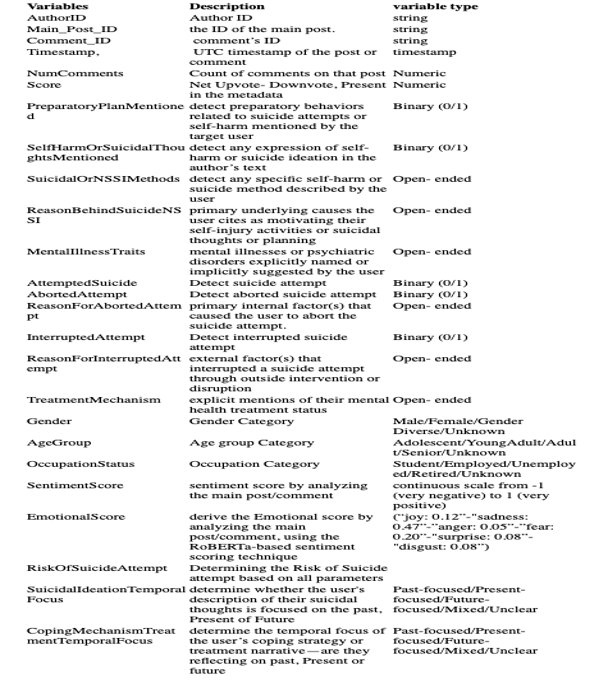
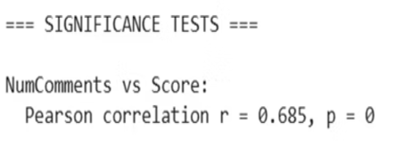
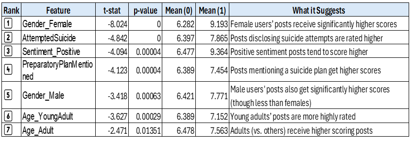
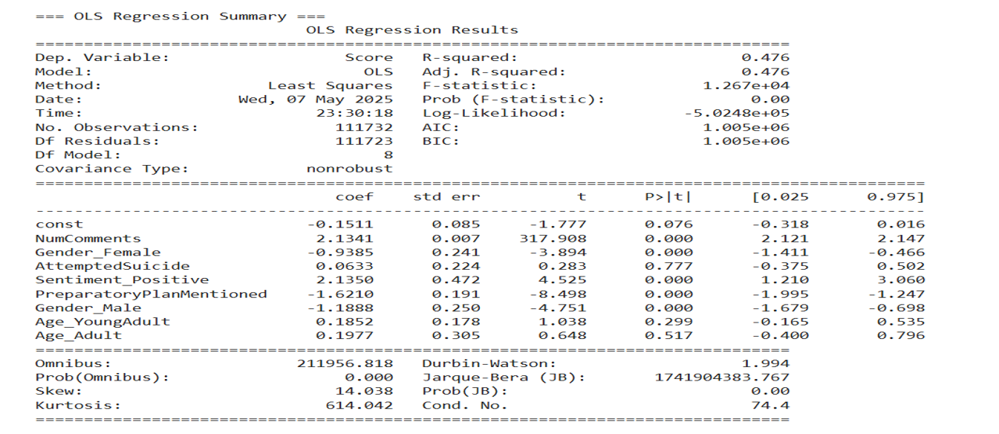
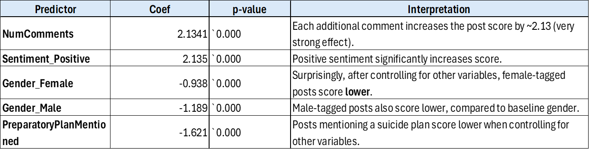
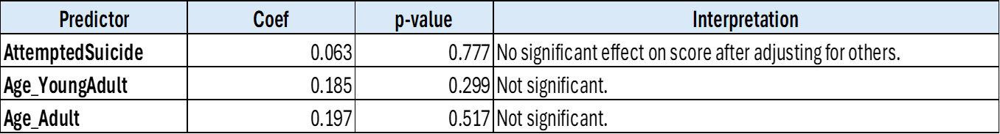
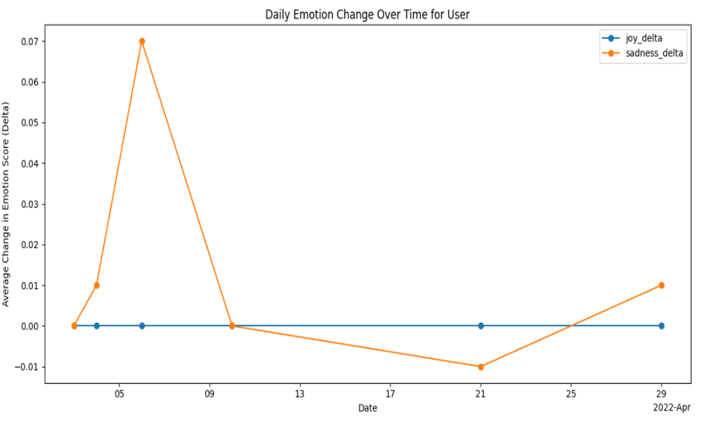
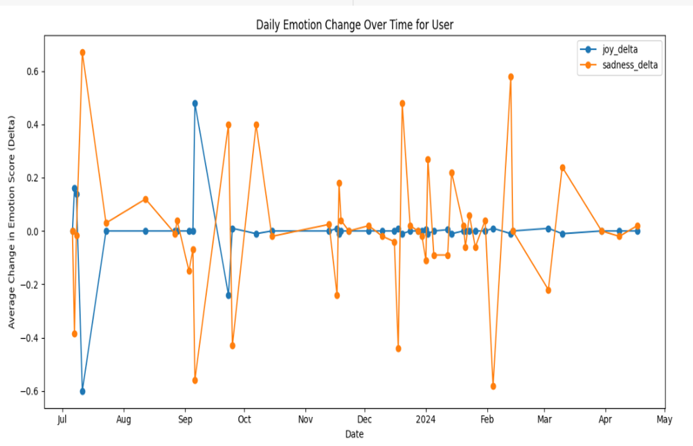

# 🧠 Self-Harm and Suicide Ideation on Reddit using LLM

---

## 🧠 Abstract

This project analyzes self-harm and suicide ideation behaviors on Reddit’s `r/suicideWatch` community. We apply prompt-based feature extraction using large language models (LLMs) alongside validated psychological frameworks (C-SSRS, SITBI, DSM-V). Our objective is to understand emotional evolution in users over time and assess the impact of coping and treatment mechanisms on mental well-being.

---

## 🎯 Objectives

- Quantify emotional dynamics using LLMs.
- Explore gender and age differences in suicidal ideation.
- Identify risk markers like emotional instability.
- Analyze the effectiveness of coping/treatment interventions.
- Classify users into "Improved" or "Declined" emotional trajectories.

---

## 📊 Dataset

- **Source**: Academic Torrents
- **Subreddit**: `r/suicideWatch`
- **Period**: Jan 1, 2022 – Dec 31, 2024
- **Initial Size**: 140,115 users, 363,258 records
- **Post-Cleaning**: 84,798 users, 225,185 records

---

## 🧼 Dataset Preparation & Cleaning

- Removed HTML, links, and metadata.
- Grouped threads by user.
- Used precise prompts to extract features using LLM - Google Gemini
- Removed rows with missing emotional score or invalid data.
- One-hot encoded categorical features.

---

## 🧠 Feature Engineering

- Emotional scores extracted via LLMs (RoBERTa-based).
- Features inspired by C-SSRS, SITBI, and DSM-V:
  - Suicide ideation, attempts, plans
  - Coping/treatment mentions
  - Emotion trajectories (joy/sadness change)
  - Mental health traits
- Feature List:  
  

---

## 📊 Exploratory Data Analysis

- 92.6% users mentioned suicidal/NSSI thoughts.
- Only 27.4% of attempters had a preparatory plan.
- Planning significantly associated with higher attempt risk (χ² = 598.63, p < .0001).
- Gender-diverse users show high planning, but lower attempt rate than females.
- Suicide ideation, attempts and planning patterns across demographics such as Gender, age
- Performed Statistical tests such as Pearson, T-test, Chi square and VIF

---

## 📈 Statistical & Regression Analysis

- Regression used to find out which variables are significant to generate a higher score on the post (Score = upvotes - downvotes).
- Pearson correlation:  
  - `Number of Comments` strongly correlated with higher post score (r = 0.685)
- R² = 0.476, indicating model explains ~47.6% variance.
- F-statistic (1.267e+04), p ≈ 0.00 — the overall model is highly significant.
- Number of Comments and Positive Sentiments are the strongest predictors of higher post scores

**Visuals**:
- 
- 
- 
- 
- 

---

## 🧘‍♀️ Emotional & Behavioral Insights

- **Sadness** is the most intense and frequent emotion across all demographics.
- Emotional instability linked to **anxiety disorders**.
- Healthy coping (hobbies, loved ones, pets, exercise) leads to more "Improved" cases.

---

## 🧪 Emotional Change & Labeling

- Calculated emotion deltas: `sad_increase`, `joy_decrease`, etc.
- Labeled users as "Improved" or "Declined" based on emotion change ratios.
- Coping/treatment mapped to emotional evolution.

**Visuals**:
- 
- 

---

## 📌 Key Findings

- Preparatory planning is a significant risk marker for suicide attempts, but not deterministic on its own.
- Demographic factors (e.g., age, gender identity) reveal unique patterns in planning, method, attempt, and emotional expression.
- Coping mechanisms, especially creative and social ones, are linked to emotional improvement.
- Formal treatment, especially medication, shows a modest but positive impact on emotional health.
- The majority of users do not engage in any structured support, highlighting a critical gap in intervention and outreach.
- Emotional instability is strongly associated with anxiety disorders, supporting its use as a proxy indicator for risk.
- Emotional analysis over time can be an effective in tracking mental health trajectories, offering promise for early detection and intervention strategies.
- Number of Comments  and Positive Sentiments are the strongest predictors of higher post scores.

---

## 🧰 Technologies Used

- **Languages**: Python 3.9+
- **Libraries**: Pandas, NumPy, Scikit-learn, Seaborn, Matplotlib, Statsmodels
- **Machine Learning Model**: Regression
- **LLMs**: Google Gemini
- **Emotion Classification**: RoBERTa
- **Data Source**: Reddit via Academic Torrents

---

## 👥 Author
- Prasad  
 
---

